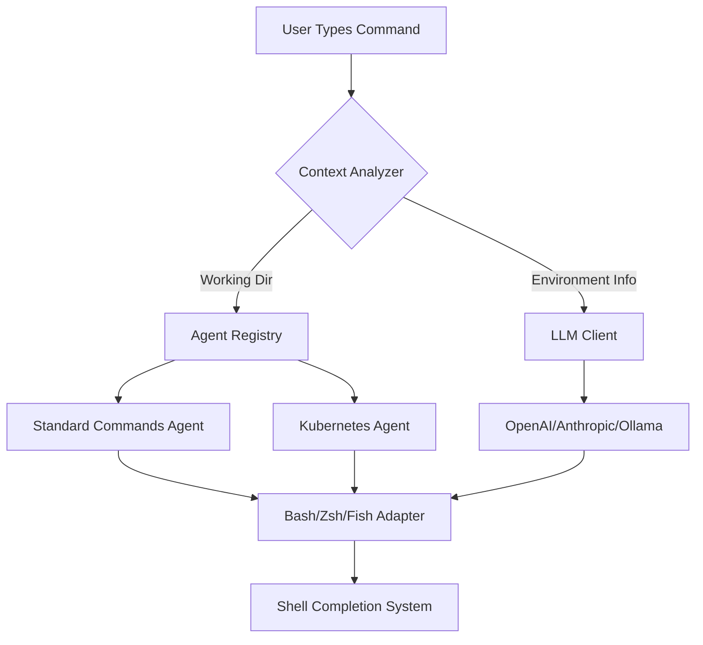

# Shelly - Intelligent Shell Completion Assistant

[](https://github.com/azyoskol/shelly/actions/workflows/ci.yml)
[](https://goreportcard.com/report/github.com/azyoskol/shelly)

**Shelly** is a production-ready Go CLI tool that provides context-aware, AI-powered shell command completions for bash, zsh, and fish with seamless starship integration.

## Quick Start

### Prerequisites

- **Go 1.20+** (for building from source)
- **Docker** (for testing with different shells)
- **VS Code** (optional, for devcontainer setup)

### Docker-Based Testing

Test Shelly's completions across different shells using our pre-configured containers:

```bash
# Start all shell testing containers
docker-compose up -d

# Access each container and test completions
docker exec shelly-bash bash
echo 'git cl' | COMP_LINE=$(echo 'git cl') COMP_CWORD=3 compgen -W $(shelly)
```

### DevContainer Setup

For a seamless development experience with all tools pre-configured:

1. Open this repository in VS Code
2. Press `F1` → Select "Dev Containers: Reopen in Container"
3. The container will build automatically with Go toolchain, testing utilities, and shell completion frameworks

## Shell Integration Guide

### Installing Shell Completions

#### Bash

Add to your `~/.bashrc` or `~/.profile`:

```bash
# Load Shelly completions
if [ -f "/path/to/shelly/completion/bash.sh" ]; then
    . "/path/to/shelly/completion/bash.sh"
fi
```

Then reload your shell: `source ~/.bashrc`

#### Zsh

Add to your `~/.zshrc`:

```bash
# Load Shelly completions with zsh-completions framework
autoload -U +compinit && compinit -C
if [ -f "/path/to/shelly/completion/zsh.sh" ]; then
    . "/path/to/shelly/completion/zsh.sh"
fi
```

#### Fish

Add to your `~/.config/fish/config.fish`:

```fish
# Load Shelly completions
if test -f /path/to/shelly/completion/fish.fish
    source /path/to/shelly/completion/fish.fish
end
```

### Configuration (config.yaml)

Create a `~/.shelly/config.yaml` to customize behavior:

```yaml
telemetry:
  enabled: true
  api_url: https://telemetry.shelly.ai/v1/event

llm:
  provider: "openai"  # Options: openai, anthropic, huggingface, ollama, lmstudio
  model: "gpt-4o"
  max_tokens: 2048
  temperature: 0.7
  timeout_seconds: 30

context:
  enable_session_history: true
  session_max_size: 100
  enable_project_detection: true
  include_environment_info: true

rate_limiting:
  requests_per_second: 10
  burst_size: 20
fallback:
  use_cached_results: true
  cache_ttl_seconds: 3600
```

### LLM Provider Setup (Quick Start)

#### OpenAI / Anthropic

Export your API key as an environment variable:

```bash
export OPENAI_API_KEY="sk-xxx"
export ANTHROPIC_API_KEY="sk-ant-xxx"
```

#### Ollama (Local LLM)

1. Install Ollama: `curl -fsSL https://ollama.com/install | sh`
2. Pull a model: `ollama pull llama3`
3. Shelly will automatically use it when no API key is set

## Examples & Use Cases

### Common Development Workflows

#### Git Operations with Context-Aware Suggestions

When you type `git cl`, Shelly suggests:
- `git clone https://github.com/azyoskol/shelly.git`
- `git checkout -b feature/ai-completions`
- `git push origin main`

The suggestions are prioritized based on your current working directory and recent activity.

#### Docker Container Management

For `docker run`, Shelly provides:
- `docker run -it --rm shelly:latest`
- `docker build . -t shelly`
- `docker compose up -d`

Each suggestion includes relevant flags based on the container image and use case.

#### Go Toolchain Commands

For `go `, Shelly suggests:
- `go mod init github.com/azyoskol/shelly`
- `go get github.com/spf13/cobra@latest`
- `go test ./... -coverprofile=coverage.out`

### Advanced Integration Patterns

#### CI/CD Pipeline Integration

Add Shelly to your GitHub Actions workflow for intelligent command suggestions in PR descriptions:

```yaml
- name: Generate Context-Aware Suggestions
  run: |
    shelly --context \
      --working-dir ${{ github.workspace }} \
      --input "git commit" \
      --output pr-description.md
```

#### Starship Plugin Usage

Display Shelly's module info in your terminal status line:

```bash
# In your .config/starship/init.toml
[modules.right.shelly]
  disabled = false
  style    = "green"
  command  = "shelly plugin"
  when     = "$SHHELLY_MODULE_INFO != ''"
```

#### Custom Agent Creation

Create domain-specific completion agents:

```go
type KubernetesAgent struct {
    kubeconfig string
}

func (a *KubernetesAgent) GenerateSuggestions(input string) ([]Suggestion, error) {
    // Return kubectl commands based on context
    return []Suggestion{
        {Text: "kubectl get pods -n production", Description: "List running pods"},
        {Text: "kubectl apply -f deployment.yaml", Description: "Apply Kubernetes manifest"},
    }, nil
}
```

Register it in your registry and use when working with K8s manifests.

### Real-World Scenarios

#### Scenario 1: Working on a Go Project

```bash
# You're in /home/projects/my-go-app
echo 'go run' | COMP_LINE=$(echo 'go run') COMP_CWORD=3 compgen -W $(shelly)
```

Suggestions include:
- `go run cmd/main.go --config config.yaml`
- `go run ./internal/commands/deploy`
- `go test ./... -v -cover`

#### Scenario 2: Docker Deployment

```bash
# You're deploying a container
echo 'docker run' | COMP_LINE=$(echo 'docker run') COMP_CWORD=3 compgen -W $(shelly)
```

Context-aware suggestions:
- `docker run --name myapp -p 8080:80 nginx:latest`
- `docker run -v /data:/var/lib/mysql mysql:8`
- `docker run --rm -it alpine bash`

#### Scenario 3: Git Branching Strategy

```bash
# You're in a git repo
echo 'git checkout' | COMP_LINE=$(echo 'git checkout') COMP_CWORD=3 compgen -W $(shelly)
```

Smart suggestions:
- `git checkout -b feature/user-authentication`
- `git checkout -b fix/memory-leak-in-handler`
- `git checkout upstream/main`

## Architecture Overview

### High-Level System Diagram



### Component Descriptions

- **Context Analyzer**: Extracts working directory, active environments (conda/virtualenv), and command history
- **Agent Registry**: Manages multiple agents providing domain-specific completions
- **LLM Client**: Unified interface for cloud-based (OpenAI, Anthropic) and local LLMs (Ollama)
- **Shell Adapters**: Bash, Zsh, and Fish implementations with graceful degradation fallbacks
- **Standard Commands Agent**: Pre-loaded common commands (git, docker, go) prioritized by context

### Error Handling Strategy

Shelly implements a multi-layered error handling approach:

1. **Graceful Degradation**: Falls back to cached results or standard completions when LLM unavailable
2. **Rate Limiting**: Exponential backoff with maximum retry attempts per provider
3. **Fallback Chain**: OpenAI → Anthropic → HuggingFace → Ollama → LMStudio → Cached → Standard
4. **Context Validation**: Returns specific errors for missing context (e.g., `ErrContextUnavailable`)

### Testing Approach

- **Unit Tests**: Each agent tested independently with >80% code coverage target
- **Integration Tests**: End-to-end tests with different shell adapters and LLM providers
- **Performance Tests**: <100ms latency for standard commands (cached), <2s P95 for LLM queries
- **Fuzzing**: Edge case testing in context analyzer to prevent panics

## Contributing

See [CONTRIBUTING.md](./CONTRIBUTING.md) for coding standards, PR process, and code review guidelines.

## License

MIT License - see [LICENSE](./LICENSE) file for details.
